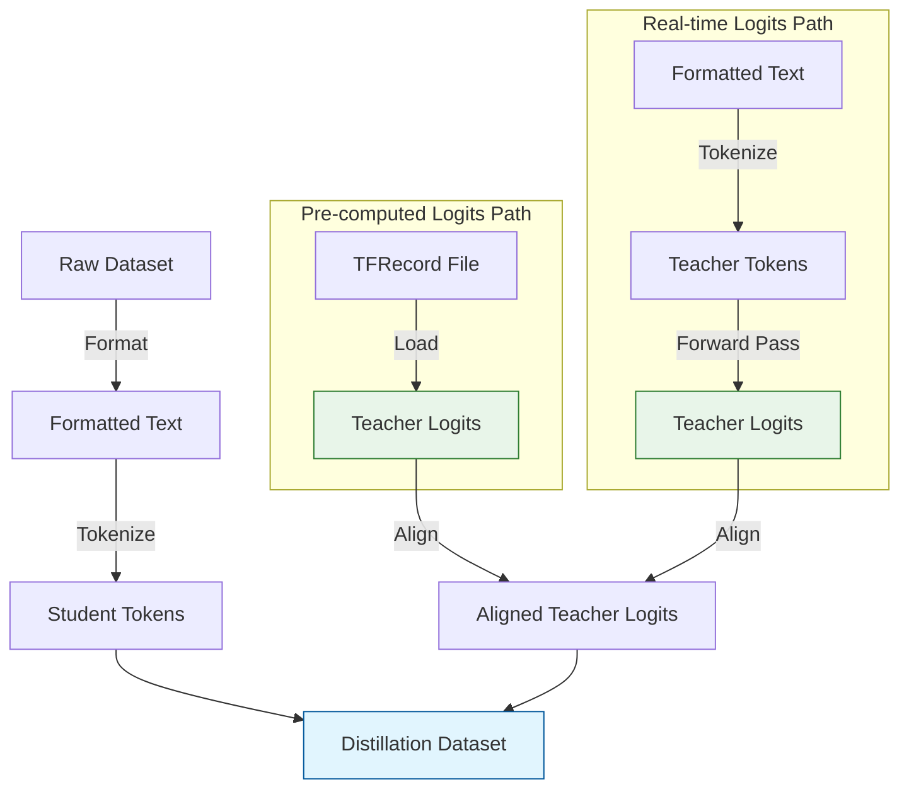

# Dataset Handling

The `DistilKitPlus` library provides flexible dataset handling specifically designed for knowledge distillation tasks. The core components are found in `distillKitPlus/components/dataset.py`, primarily involving the `DistillationDataset` and `TFRecordDataLoader` classes.

## Data Flow Overview

The dataset system in DistilKitPlus handles the entire data pipeline for both student and teacher models, including loading source data, pre-computing or real-time generation of teacher logits, and preparing properly formatted inputs.



## `DistillationDataset`

This is the main dataset class you'll interact with. It inherits from `torch.utils.data.Dataset` and orchestrates the loading, formatting, tokenization, and integration of student data and teacher logits.

### Initialization Parameters

Parameter | Type | Description
--------- | ---- | -----------
`file_path` | str | Path to the dataset file or directory (supports Hugging Face `datasets` loading methods, including JSON/JSONL)
`tokenizer` | AutoTokenizer | The tokenizer for the student model
`max_seq_length` | int | Maximum sequence length for filtering and tokenization (samples longer than this are discarded)
`teacher_vocab_size` | int | The vocabulary size of the teacher model, required if loading logits
`teacher_tokenizer` | Optional[AutoTokenizer] | The tokenizer for the teacher model, **required** if `loss_type` is 'uld' or 'multi-ot'
`teacher_format_func` | Optional[Callable] | A function to format examples specifically for the teacher model, **required** if `loss_type` is 'uld' or 'multi-ot'
`teacher_data_collator` | Optional[Callable] | A data collator for teacher labels, **required** if `loss_type` is 'uld' or 'multi-ot'
`format_func` | Optional[Callable] | A function to format examples before tokenization (defaults to returning the 'text' field)
`split` | Optional[str] | The specific dataset split to load (e.g., 'train', 'validation')
`num_samples` | Optional[int] | Limit the dataset to a specific number of samples (after filtering by `max_seq_length`)
`logits_file` | Optional[str] | Path to the TFRecord file containing teacher logits
`select_range` | Optional[Tuple[int, int]] | A tuple specifying a start and end index to select a specific range of samples
`ignore_index` | int | Index to ignore in loss calculations (standard for labels), default=-100
`loss_type` | Optional[str] | Specifies the loss type (e.g., 'uld', 'multi-ot'), affects whether teacher-specific processing is performed

### Core Functionality

<Steps>

### 1. Loading
Loads the dataset using Hugging Face `datasets` based on `file_path` and `split`. Supports loading from disk or hub, including JSON/JSONL formats.

```python
# Example config.json snippet
{
  "dataset": {
    "name": "tatsu-lab/alpaca",  // HF dataset or local path
    "split": "train"
  }
}
```

### 2. Formatting
Applies the `format_func` to prepare the text data for the student tokenizer. If `loss_type` requires it, also applies `teacher_format_func` to prepare text for the teacher tokenizer.

```python
# Default formatter simply extracts the 'text' field
def default_format(example):
    return {"text": example["text"]}

# For chat datasets with messages
def chat_format(tokenizer):
    def format_func(example):
        messages = example["messages"]
        return {"text": tokenizer.apply_chat_template(messages, tokenize=False)}
    return format_func
```

### 3. Tokenization
Tokenizes the formatted text using the provided `tokenizer` (student) and optionally the `teacher_tokenizer`. It handles truncation based on `max_seq_length`. For 'uld' or 'multi-ot' losses, it uses the `teacher_data_collator` to generate `teacher_labels`.

```python
# Simplified tokenization logic
tokenized_inputs = tokenizer(
    formatted_texts,
    truncation=True,
    max_length=max_seq_length,
    return_tensors="pt",
    padding=False
)
```

### 4. Filtering
Filters the dataset to keep only samples whose tokenized length (using the student tokenizer) is less than or equal to `max_seq_length`.

```python
# Samples are filtered if they exceed max_seq_length
valid_indices = [i for i, length in enumerate(lengths) if length <= max_seq_length]
```

### 5. Logits Integration
If `logits_file` is provided, it initializes a `TFRecordDataLoader` instance to load corresponding teacher logits for the valid samples. It ensures the number of valid samples matches the number of loaded logits.

```python
# Config with pre-computed logits
{
  "dataset": {
    "logits_file": "path/to/teacher_logits.tfrecord",
    "name": "my_dataset"
  },
  "models": {
    "teacher_vocab_size": 128256  // Must match the teacher that generated logits
  }
}
```

### 6. Sampling
Allows selecting a subset of the data using `num_samples` or `select_range`.

```python
# Limit to first 1000 samples
{
  "dataset": {
    "num_samples": 1000
  }
}

# Use specific range (e.g., samples 5000-10000)
{
  "dataset": {
    "select_range": [5000, 10000]
  }
}
```

</Steps>

### Output Structure

Each item retrieved via `__getitem__` is a dictionary containing:

- `input_ids`: Token IDs for the student model
- `attention_mask`: Attention mask for the student model
- `logits` (Optional): Teacher logits loaded from the TFRecord file
- `teacher_input_ids` (Optional): Token IDs for the teacher model (if `loss_type` requires)
- `teacher_attention_mask` (Optional): Attention mask for the teacher model (if `loss_type` requires)
- `teacher_labels` (Optional): Labels generated for the teacher model (if `loss_type` requires)

## `TFRecordDataLoader`

This class is used internally by `DistillationDataset` when `logits_file` is provided. It's responsible for efficiently reading teacher logits stored in the TFRecord format.

### Key Features

- **Indexing:** Indexes the TFRecord file on initialization to allow quick random access to specific records
- **Parsing:** Parses the TFRecord protobuf messages to extract logits (stored as serialized float16 arrays) and sequence lengths
- **Filtering:** Can be initialized with `valid_indices` (provided by `DistillationDataset` after length filtering) to only load logits corresponding to valid student samples
- **Sampling:** Supports loading only a specific `num_samples`

### Memory Efficiency

Using pre-computed logits with `TFRecordDataLoader` significantly reduces memory usage during training, as it avoids loading the teacher model entirely:

<div className="flex p-4 mb-4 border border-green-200 rounded-lg bg-green-50 dark:bg-green-900/30 dark:border-green-900/50">
  <div className="flex-1">
    <h4 className="text-lg font-medium text-green-800 dark:text-green-400">Memory Usage Comparison</h4>
    <table className="min-w-full divide-y divide-green-200 dark:divide-green-800">
      <thead>
        <tr>
          <th className="px-4 py-2 text-left text-sm font-medium text-green-800 dark:text-green-300">Approach</th>
          <th className="px-4 py-2 text-left text-sm font-medium text-green-800 dark:text-green-300">Memory Usage</th>
          <th className="px-4 py-2 text-left text-sm font-medium text-green-800 dark:text-green-300">Trade-offs</th>
        </tr>
      </thead>
      <tbody className="divide-y divide-green-100 dark:divide-green-800/30">
        <tr>
          <td className="px-4 py-2 text-sm text-green-900 dark:text-green-100">On-the-fly logits</td>
          <td className="px-4 py-2 text-sm text-green-900 dark:text-green-100">High (Teacher + Student models)</td>
          <td className="px-4 py-2 text-sm text-green-900 dark:text-green-100">Flexible, no preprocessing needed</td>
        </tr>
        <tr>
          <td className="px-4 py-2 text-sm text-green-900 dark:text-green-100">Pre-computed logits</td>
          <td className="px-4 py-2 text-sm text-green-900 dark:text-green-100">Low (Student model only)</td>
          <td className="px-4 py-2 text-sm text-green-900 dark:text-green-100">Requires logit generation step beforehand</td>
        </tr>
      </tbody>
    </table>
  </div>
</div>

## Best Practices

1. **Dataset Size Management:**
   - Start with a small `num_samples` (e.g., 1000) for quick testing
   - For full training, ensure you have sufficient disk space for logit files (they can be large!)

2. **Tokenizer Compatibility:**
   - For optimal results, ensure student and teacher tokenizers are compatible when using 'uld' or 'multi-ot' losses
   - If vocabularies differ significantly, consider using 'fkl' loss type instead

3. **Efficient Logit Generation:**
   - Generate logits on powerful hardware (A100/H100 GPUs) but train with pre-computed logits on less powerful hardware
   - Consider generating logits in batches if the entire dataset is very large

4. **Troubleshooting:**
   - If you encounter out-of-memory errors with on-the-fly logits, switch to pre-computed logits
   - Validate your logits file size is appropriate (roughly `num_samples × sequence_length × teacher_vocab_size × 2 bytes` for float16 logits)