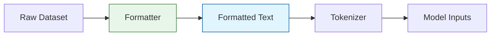

# Data Formatters

The `distillKitPlus/components/formatters.py` module provides functions to pre-process raw dataset examples into a text format suitable for tokenization. These formatters handle different dataset structures and leverage chat templates associated with Hugging Face tokenizers.

## Formatter System Overview

Formatters serve as the bridge between raw datasets and the tokenization process. They transform dataset examples (which can have various structures) into a consistent format that can be properly tokenized.



## How Formatters Work

The formatter system follows a factory pattern to provide the appropriate formatting function based on your configuration:

1. **Selection:** The `get_formatter(format_function_name, tokenizer)` function looks up the formatter name specified in your config.
2. **Instantiation:** It calls the corresponding *formatter factory* function (e.g., `default_format(tokenizer)`).
3. **Mapping:** The returned `format_func` is applied to your dataset, transforming each example into a dictionary with a `"text"` key.

This process is handled internally by the `DistillationDataset` class when you specify a formatter in your configuration:

```json
{
  "dataset": {
    "format_function": "default_format"  // or "sharegpt_format", etc.
  }
}
```

## Available Formatters

DistilKitPlus includes several built-in formatters to handle common dataset formats:

<div className="overflow-x-auto mt-4">
  <table className="min-w-full divide-y divide-gray-200 dark:divide-gray-700">
    <thead>
      <tr>
        <th className="px-4 py-3 text-left text-sm font-medium text-gray-500 dark:text-gray-400 uppercase tracking-wider">Format Function Name</th>
        <th className="px-4 py-3 text-left text-sm font-medium text-gray-500 dark:text-gray-400 uppercase tracking-wider">Best For</th>
        <th className="px-4 py-3 text-left text-sm font-medium text-gray-500 dark:text-gray-400 uppercase tracking-wider">Input Structure</th>
        <th className="px-4 py-3 text-left text-sm font-medium text-gray-500 dark:text-gray-400 uppercase tracking-wider">Output</th>
      </tr>
    </thead>
    <tbody className="divide-y divide-gray-200 dark:divide-gray-700">
      <tr>
        <td className="px-4 py-3 text-sm font-medium text-gray-900 dark:text-gray-100">"default_format"</td>
        <td className="px-4 py-3 text-sm text-gray-600 dark:text-gray-300">Standard HF chat datasets</td>
        <td className="px-4 py-3 text-sm text-gray-600 dark:text-gray-300">Example with "messages" field containing chat turns</td>
        <td className="px-4 py-3 text-sm text-gray-600 dark:text-gray-300">Text with applied chat template</td>
      </tr>
      <tr>
        <td className="px-4 py-3 text-sm font-medium text-gray-900 dark:text-gray-100">"sharegpt_format"</td>
        <td className="px-4 py-3 text-sm text-gray-600 dark:text-gray-300">ShareGPT datasets</td>
        <td className="px-4 py-3 text-sm text-gray-600 dark:text-gray-300">Example with "conversations" field containing turns</td>
        <td className="px-4 py-3 text-sm text-gray-600 dark:text-gray-300">Text with applied chat template</td>
      </tr>
      <tr>
        <td className="px-4 py-3 text-sm font-medium text-gray-900 dark:text-gray-100">"comparison_format"</td>
        <td className="px-4 py-3 text-sm text-gray-600 dark:text-gray-300">Response comparison datasets</td>
        <td className="px-4 py-3 text-sm text-gray-600 dark:text-gray-300">Example with "prompt", "response_a", "response_b", etc.</td>
        <td className="px-4 py-3 text-sm text-gray-600 dark:text-gray-300">Multi-turn chat with comparison structure</td>
      </tr>
      <tr>
        <td className="px-4 py-3 text-sm font-medium text-gray-900 dark:text-gray-100">"format_for_tokenization"</td>
        <td className="px-4 py-3 text-sm text-gray-600 dark:text-gray-300">Simple text datasets</td>
        <td className="px-4 py-3 text-sm text-gray-600 dark:text-gray-300">Example with "text" field</td>
        <td className="px-4 py-3 text-sm text-gray-600 dark:text-gray-300">Raw text (no chat template)</td>
      </tr>
    </tbody>
  </table>
</div>

### 1. Default Format (`"default_format"`)

This formatter is designed for datasets following the standard Hugging Face chat format, with a `"messages"` field containing a list of chat turns (each with `"role"` and `"content"`).

<div className="p-4 bg-gradient-to-r from-blue-50 to-indigo-50 dark:from-blue-900/30 dark:to-indigo-900/30 rounded-lg border border-blue-100 dark:border-blue-900/50 my-4">
  <h4 className="text-lg font-semibold text-blue-800 dark:text-blue-300">Default Format Example</h4>
  
  <div className="grid grid-cols-1 md:grid-cols-2 gap-4 mt-3">
    <div>
      <h5 className="font-medium text-blue-800 dark:text-blue-400 mb-1">Input Example</h5>
      <div className="text-xs text-gray-700 dark:text-gray-300 font-mono bg-gray-50 dark:bg-gray-800/50 p-2 rounded overflow-x-auto">
        <pre>
```json
{
  "messages": [
    {
      "role": "system",
      "content": "You are a helpful assistant."
    },
    {
      "role": "user",
      "content": "What is the capital of France?"
    },
    {
      "role": "assistant",
      "content": "The capital of France is Paris."
    }
  ]
}
```
        </pre>
      </div>
    </div>
    
    <div>
      <h5 className="font-medium text-blue-800 dark:text-blue-400 mb-1">Output</h5>
      <div className="text-xs text-gray-700 dark:text-gray-300 font-mono bg-gray-50 dark:bg-gray-800/50 p-2 rounded overflow-x-auto">
        <pre>
```json
{
  "text": "<|start_header_id|>system<|end_header_id|>\n\nYou are a helpful assistant.<|start_header_id|>user<|end_header_id|>\n\nWhat is the capital of France?<|start_header_id|>assistant<|end_header_id|>\n\nThe capital of France is Paris."
}
```
        </pre>
      </div>
    </div>
  </div>
  
  <div className="mt-3">
    <h5 className="font-medium text-blue-800 dark:text-blue-400 mb-1">Implementation</h5>
    <div className="text-xs text-gray-700 dark:text-gray-300 font-mono bg-gray-50 dark:bg-gray-800/50 p-2 rounded overflow-x-auto">
      <pre>
```python
def default_format(tokenizer):
    def format_func(example):
        messages = example["messages"]
        return {"text": tokenizer.apply_chat_template(messages, tokenize=False)}
    return format_func
```
      </pre>
    </div>
  </div>
</div>

### 2. ShareGPT Format (`"sharegpt_format"`)

This formatter is designed for datasets following the ShareGPT structure, which uses a different format than the standard Hugging Face chat format.

<div className="p-4 bg-gradient-to-r from-green-50 to-teal-50 dark:from-green-900/30 dark:to-teal-900/30 rounded-lg border border-green-100 dark:border-green-900/50 my-4">
  <h4 className="text-lg font-semibold text-green-800 dark:text-green-300">ShareGPT Format Example</h4>
  
  <div className="grid grid-cols-1 md:grid-cols-2 gap-4 mt-3">
    <div>
      <h5 className="font-medium text-green-800 dark:text-green-400 mb-1">Input Example</h5>
      <div className="text-xs text-gray-700 dark:text-gray-300 font-mono bg-gray-50 dark:bg-gray-800/50 p-2 rounded overflow-x-auto">
        <pre>
```json
{
  "conversations": [
    {
      "from": "human",
      "value": "What is the capital of France?"
    },
    {
      "from": "gpt",
      "value": "The capital of France is Paris."
    }
  ]
}
```
        </pre>
      </div>
    </div>
    
    <div>
      <h5 className="font-medium text-green-800 dark:text-green-400 mb-1">Output</h5>
      <div className="text-xs text-gray-700 dark:text-gray-300 font-mono bg-gray-50 dark:bg-gray-800/50 p-2 rounded overflow-x-auto">
        <pre>
```json
{
  "text": "<|start_header_id|>system<|end_header_id|>\n\nYou are a helpful assistant.<|start_header_id|>user<|end_header_id|>\n\nWhat is the capital of France?<|start_header_id|>assistant<|end_header_id|>\n\nThe capital of France is Paris."
}
```
        </pre>
      </div>
    </div>
  </div>
  
  <div className="mt-3">
    <h5 className="font-medium text-green-800 dark:text-green-400 mb-1">Key Features</h5>
    <ul className="list-disc list-inside text-sm text-gray-700 dark:text-gray-300 space-y-1">
      <li>Converts ShareGPT format to standard HF format</li>
      <li>Maps "human" → "user", "gpt" → "assistant", "system" → "system"</li>
      <li>Adds default system message if none exists</li>
      <li>Applies the model's chat template</li>
    </ul>
  </div>
</div>

### 3. Comparison Format (`"comparison_format"`)

This formatter is tailored for datasets comparing two model responses to a prompt, including a rationale and winner.

<div className="p-4 bg-gradient-to-r from-purple-50 to-pink-50 dark:from-purple-900/30 dark:to-pink-900/30 rounded-lg border border-purple-100 dark:border-purple-900/50 my-4">
  <h4 className="text-lg font-semibold text-purple-800 dark:text-purple-300">Comparison Format Example</h4>
  
  <div className="grid grid-cols-1 md:grid-cols-2 gap-4 mt-3">
    <div>
      <h5 className="font-medium text-purple-800 dark:text-purple-400 mb-1">Input Example</h5>
      <div className="text-xs text-gray-700 dark:text-gray-300 font-mono bg-gray-50 dark:bg-gray-800/50 p-2 rounded overflow-x-auto">
        <pre>
```json
{
  "prompt": "What is the capital of France?",
  "response_a": "The capital of France is Paris.",
  "response_b": "Paris is the capital city of France.",
  "rationale": "Both answers are correct and concise.",
  "winner": "tie"
}
```
        </pre>
      </div>
    </div>
    
    <div>
      <h5 className="font-medium text-purple-800 dark:text-purple-400 mb-1">Output (Chat Structure)</h5>
      <div className="text-xs text-gray-700 dark:text-gray-300 font-mono bg-gray-50 dark:bg-gray-800/50 p-2 rounded overflow-x-auto">
        <pre>
```json
{
  "text": "<|start_header_id|>system<|end_header_id|>\n\nYou are comparing two responses...<|start_header_id|>user<|end_header_id|>\n\nPrompt: What is the capital of France?\n\nResponse A: The capital of France is Paris.\n\nResponse B: Paris is the capital city of France.<|start_header_id|>assistant<|end_header_id|>\n\nRationale: Both answers are correct and concise.\n\nWinner: tie"
}
```
        </pre>
      </div>
    </div>
  </div>
  
  <div className="mt-3">
    <h5 className="font-medium text-purple-800 dark:text-purple-400 mb-1">Structure</h5>
    <ol className="list-decimal list-inside text-sm text-gray-700 dark:text-gray-300 space-y-1">
      <li>System message explaining the comparison task</li>
      <li>User message containing the prompt and both responses</li>
      <li>Assistant message with the rationale and winner</li>
    </ol>
  </div>
</div>

### 4. Simple Text Format (`"format_for_tokenization"`)

This minimal formatter simply extracts text without applying any chat templating.

<div className="p-4 bg-gradient-to-r from-yellow-50 to-amber-50 dark:from-yellow-900/30 dark:to-amber-900/30 rounded-lg border border-yellow-100 dark:border-yellow-900/50 my-4">
  <h4 className="text-lg font-semibold text-yellow-800 dark:text-yellow-300">Simple Text Format Example</h4>
  
  <div className="grid grid-cols-1 md:grid-cols-2 gap-4 mt-3">
    <div>
      <h5 className="font-medium text-yellow-800 dark:text-yellow-400 mb-1">Input Example</h5>
      <div className="text-xs text-gray-700 dark:text-gray-300 font-mono bg-gray-50 dark:bg-gray-800/50 p-2 rounded overflow-x-auto">
        <pre>
```json
{
  "text": "The quick brown fox jumps over the lazy dog."
}
```
        </pre>
      </div>
    </div>
    
    <div>
      <h5 className="font-medium text-yellow-800 dark:text-yellow-400 mb-1">Output</h5>
      <div className="text-xs text-gray-700 dark:text-gray-300 font-mono bg-gray-50 dark:bg-gray-800/50 p-2 rounded overflow-x-auto">
        <pre>
```json
{
  "text": "The quick brown fox jumps over the lazy dog."
}
```
        </pre>
      </div>
    </div>
  </div>
  
  <div className="mt-3">
    <h5 className="font-medium text-yellow-800 dark:text-yellow-400 mb-1">Implementation</h5>
    <div className="text-xs text-gray-700 dark:text-gray-300 font-mono bg-gray-50 dark:bg-gray-800/50 p-2 rounded overflow-x-auto">
      <pre>
```python
def format_for_tokenization(tokenizer):
    def format_func(example):
        # Just extract the "text" field
        if "text" in example:
            return {"text": example["text"]}
        return example
    return format_func
```
      </pre>
    </div>
  </div>
</div>

## Creating Custom Formatters

You can create your own formatters for specific dataset structures. Here's a template for creating a custom formatter:

```python
def my_custom_formatter(tokenizer):
    def format_func(example):
        # Extract and process data from example
        # example: {"my_field": "value", "other_field": [...]}
        
        # Process the data
        processed_text = process_my_data(example)
        
        # Return a dictionary with the "text" key
        return {"text": processed_text}
    return format_func

# Register the formatter in formatters.py
FORMATTERS = {
    "default_format": default_format,
    "sharegpt_format": sharegpt_format,
    "comparison_format": comparison_format,
    "format_for_tokenization": format_for_tokenization,
    "my_custom_formatter": my_custom_formatter,  # Add your formatter here
}
```

## Best Practices

1. **Chat Template Compatibility:**
   - Make sure your custom formatter produces text compatible with your model's chat template
   - For models with specific format requirements (Llama, Mistral, etc.), ensure your formatter produces compatible text

2. **Handling Diverse Datasets:**
   - For chat datasets not in standard format, convert to the format expected by `tokenizer.apply_chat_template()`
   - Ensure system prompts are included when appropriate

3. **Dataset Exploration:**
   - Before choosing or creating a formatter, examine your dataset structure
   - Use `example = dataset[0]` and `print(example)` to understand your dataset format

4. **Special Tokens:**
   - Be aware of special tokens that might be required by your model
   - Some models need specific markers like BOS (Beginning of Sequence) or EOS (End of Sequence)