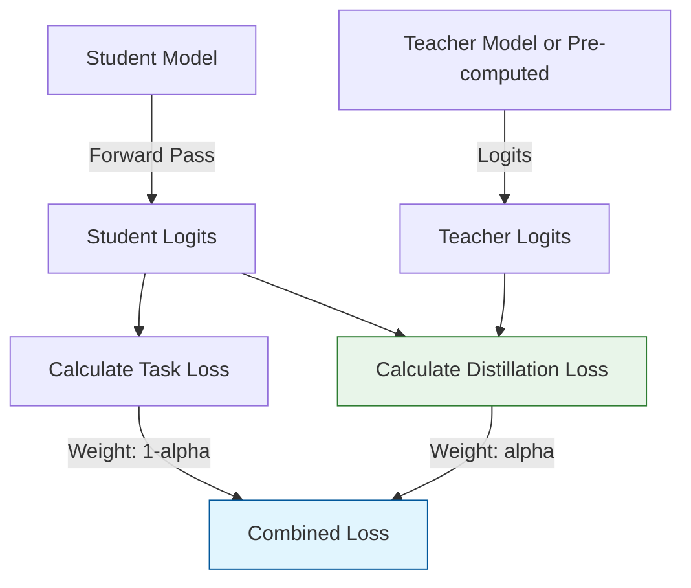

# Distillation Loss Functions

The `distillKitPlus/components/loss.py` module provides various loss functions specialized for knowledge distillation. These functions balance standard task losses (like language modeling loss) with distillation-specific terms that encourage the student model to mimic the teacher's behavior.

## Loss Function Comparison

Different loss functions have unique characteristics that make them suitable for different distillation scenarios:

<div className="overflow-x-auto">
  <table className="min-w-full divide-y divide-gray-200 dark:divide-gray-700">
    <thead>
      <tr>
        <th className="px-4 py-3 text-left text-sm font-medium text-gray-500 dark:text-gray-400 uppercase tracking-wider">Loss Type</th>
        <th className="px-4 py-3 text-left text-sm font-medium text-gray-500 dark:text-gray-400 uppercase tracking-wider">Best For</th>
        <th className="px-4 py-3 text-left text-sm font-medium text-gray-500 dark:text-gray-400 uppercase tracking-wider">Memory</th>
        <th className="px-4 py-3 text-left text-sm font-medium text-gray-500 dark:text-gray-400 uppercase tracking-wider">Computation</th>
        <th className="px-4 py-3 text-left text-sm font-medium text-gray-500 dark:text-gray-400 uppercase tracking-wider">Special Requirements</th>
      </tr>
    </thead>
    <tbody className="divide-y divide-gray-200 dark:divide-gray-700">
      <tr>
        <td className="px-4 py-3 text-sm text-gray-900 dark:text-gray-100">Forward KL (fkl, kld)</td>
        <td className="px-4 py-3 text-sm text-gray-600 dark:text-gray-300">Same architecture distillation</td>
        <td className="px-4 py-3 text-sm text-gray-600 dark:text-gray-300">Medium</td>
        <td className="px-4 py-3 text-sm text-gray-600 dark:text-gray-300">Low</td>
        <td className="px-4 py-3 text-sm text-gray-600 dark:text-gray-300">None</td>
      </tr>
      <tr>
        <td className="px-4 py-3 text-sm text-gray-900 dark:text-gray-100">Unbiased Logit Distillation (uld)</td>
        <td className="px-4 py-3 text-sm text-gray-600 dark:text-gray-300">Cross-architecture distillation</td>
        <td className="px-4 py-3 text-sm text-gray-600 dark:text-gray-300">Low</td>
        <td className="px-4 py-3 text-sm text-gray-600 dark:text-gray-300">Medium</td>
        <td className="px-4 py-3 text-sm text-gray-600 dark:text-gray-300">Requires teacher_labels</td>
      </tr>
      <tr>
        <td className="px-4 py-3 text-sm text-gray-900 dark:text-gray-100">Multi-Level Optimal Transport (multi-ot)</td>
        <td className="px-4 py-3 text-sm text-gray-600 dark:text-gray-300">Highest quality distillation</td>
        <td className="px-4 py-3 text-sm text-gray-600 dark:text-gray-300">Medium</td>
        <td className="px-4 py-3 text-sm text-gray-600 dark:text-gray-300">High</td>
        <td className="px-4 py-3 text-sm text-gray-600 dark:text-gray-300">Requires teacher_labels, additional parameters</td>
      </tr>
    </tbody>
  </table>
</div>

## Main Entry Point: `compute_distillation_loss`

This function orchestrates the calculation of the final loss used during training.

```python
def compute_distillation_loss(
    student_logits: Tensor,
    teacher_logits: Tensor,
    original_loss: Tensor, # Loss from the student model's standard task head
    inputs: Dict[str, Any] = None,
    loss_type: str = "fkl",
    k: int = 100,
    alpha: float = 0.1,
    temperature: float = 2.0,
    **kwargs, # Includes loss_kwargs for specific loss types
) -> Tensor:
```

### Parameters

Parameter | Type | Description
--------- | ---- | -----------
`student_logits` | Tensor | Logits output by the student model
`teacher_logits` | Tensor | Logits output by the teacher model (or pre-computed)
`original_loss` | Tensor | Original loss calculated by the student model (e.g., cross-entropy loss)
`inputs` | Dict[str, Any] | Batch data, potentially containing labels needed by some loss types
`loss_type` | str | Which distillation loss to compute: 'fkl', 'kld', 'uld', 'multi-ot'
`k` | int | Parameter for 'uld' and 'multi-ot' losses (number of top logits)
`alpha` | float | Weighting factor: final_loss = α × distillation_loss + (1-α) × original_loss
`temperature` | float | Temperature for softening distributions in KL/softmax calculations
`**kwargs` | - | Additional arguments, notably `loss_kwargs` for certain loss types

### How the Combined Loss Works

The distillation loss combines a task-specific loss (usually language modeling loss) with a distillation term that measures how well the student mimics the teacher:



The parameter `alpha` controls the balance between these two objectives:
- `alpha = 0`: Only task loss (standard fine-tuning)
- `alpha = 1`: Only distillation loss (pure mimicry of teacher)
- `0 < alpha < 1`: Balanced approach (typical values: 0.1 to 0.5)

## Available Distillation Loss Types

### Forward KL Divergence (`'fkl'` or `'kld'`)

This is the classic knowledge distillation loss proposed by Hinton et al. It calculates the Kullback-Leibler divergence between the softmax distributions of the teacher and student models.

<div className="p-4 bg-gradient-to-r from-blue-50 to-indigo-50 dark:from-blue-900/30 dark:to-indigo-900/30 rounded-lg border border-blue-100 dark:border-blue-900/50 my-4">
  <h4 className="text-lg font-semibold text-blue-800 dark:text-blue-300">Forward KL Divergence</h4>
  <p className="mb-2 text-gray-700 dark:text-gray-300">Measures how well the student distribution P<sub>S</sub> approximates the teacher distribution P<sub>T</sub>:</p>
  <div className="text-center mb-3 font-mono">
    <span className="text-lg">D<sub>KL</sub>(P<sub>T</sub> || P<sub>S</sub>) = ∑ P<sub>T</sub>(i) × log(P<sub>T</sub>(i) / P<sub>S</sub>(i))</span>
  </div>
  <ul className="list-disc list-inside">
    <li className="text-gray-700 dark:text-gray-300">Fast and memory-efficient</li>
    <li className="text-gray-700 dark:text-gray-300">Works well with any model architecture</li>
    <li className="text-gray-700 dark:text-gray-300">Scaled by temperature<sup>2</sup> to balance gradients</li>
    <li className="text-gray-700 dark:text-gray-300">Includes padding/truncation to handle vocabulary size mismatches</li>
  </ul>
</div>

Key implementation details:
- Logits are scaled by `temperature` before computing softmax
- Teacher logits are padded/truncated if vocabulary sizes don't match
- Uses `F.kl_div` with `reduction='batchmean'` (averaged over batch and sequence)
- Final KL value is scaled by temperature² to counterbalance the reduced gradients from high temperature

### Unbiased Logit Distillation (`'uld'`)

This method focuses only on the most relevant tokens and probabilities, making it more suitable for cross-architecture distillation where logit spaces might differ.

<div className="p-4 bg-gradient-to-r from-green-50 to-teal-50 dark:from-green-900/30 dark:to-teal-900/30 rounded-lg border border-green-100 dark:border-green-900/50 my-4">
  <h4 className="text-lg font-semibold text-green-800 dark:text-green-300">Unbiased Logit Distillation</h4>
  <p className="mb-2 text-gray-700 dark:text-gray-300">Computes differences between top-k probability distributions:</p>
  <div className="text-center mb-3 font-mono">
    <span className="text-lg">ULD = mean(|TopK(P<sub>T</sub>) - TopK(P<sub>S</sub>)|<sub>1</sub>)</span>
  </div>
  <p className="mb-2 text-gray-700 dark:text-gray-300">Where:</p>
  <ul className="list-disc list-inside">
    <li className="text-gray-700 dark:text-gray-300">TopK selects the k highest probabilities</li>
    <li className="text-gray-700 dark:text-gray-300">Alignment is done using label positions from both models</li>
    <li className="text-gray-700 dark:text-gray-300">L1 norm measures absolute differences between vectors</li>
  </ul>
</div>

Key implementation details:
- Requires `inputs` dictionary to contain `'labels'` and `'teacher_labels'`
- Aligns student and teacher sequences based on valid (non-ignored) tokens
- Selects top-k probabilities from both models and computes L1 distance
- Good for different architecture distillation where full logit spaces might not align well

### Multi-Level Optimal Transport (`'multi-ot'`)

This advanced loss function uses optimal transport theory to better match teacher and student distributions, especially when vocabularies and architectures differ significantly.

<div className="p-4 bg-gradient-to-r from-purple-50 to-pink-50 dark:from-purple-900/30 dark:to-pink-900/30 rounded-lg border border-purple-100 dark:border-purple-900/50 my-4">
  <h4 className="text-lg font-semibold text-purple-800 dark:text-purple-300">Multi-Level Optimal Transport</h4>
  <p className="mb-2 text-gray-700 dark:text-gray-300">A sophisticated approach combining multiple loss components:</p>
  <div className="space-y-2">
    <p className="text-gray-700 dark:text-gray-300">1. <strong>L1 Component</strong>: Similar to ULD, measuring absolute differences</p>
    <p className="text-gray-700 dark:text-gray-300">2. <strong>KL Component</strong>: Weighted KL divergence on sorted probabilities</p>
    <p className="text-gray-700 dark:text-gray-300">3. <strong>Sinkhorn Component</strong>: Earth Mover's Distance approximation</p>
  </div>
  <p className="mt-2 text-gray-700 dark:text-gray-300">The loss balances these components using weights in loss_kwargs.</p>
</div>

Key implementation details:
- Similar initial steps to `uld_loss`: aligns sequences, computes softmax probs, selects top-k
- Applies a sorting step to the top-k probabilities using `sequence_level_sort_for_ot_loss`
- Computes a weighted KL divergence between sorted probabilities using `log_loss_weight`
- Calculates a Sinkhorn loss (approximating EMD) using `sikhorn_loss_weight`
- Most computationally intensive but often produces the highest quality results

## Configuring Loss Functions

In your configuration file, you can specify the loss type and its parameters:

```json
{
  "distillation": {
    "temperature": 2.0,           // Higher = softer distributions
    "alpha": 0.1,                 // Weight for distillation loss
    "loss_type": "uld",           // One of: "fkl", "kld", "uld", "multi-ot"
    "k": 100,                     // For "uld" and "multi-ot": number of top tokens
    "loss_kwargs": {              // Additional parameters for specific losses
      "log_loss_weight": 0.1,     // For "multi-ot": weight for KL component
      "sikhorn_loss_weight": 0.1  // For "multi-ot": weight for Sinkhorn component
    }
  }
}
```

## Loss Selection Guide

Here are recommendations for which loss function to use based on your specific scenario:

### Choose Forward KL (fkl) when:
- Teacher and student have the same architecture (e.g., both Llama family)
- You're looking for a simple, efficient approach
- Memory usage is a concern

### Choose Unbiased Logit Distillation (uld) when:
- Teacher and student have different architectures
- Vocabulary sizes differ significantly
- You want a balanced approach between quality and efficiency

### Choose Multi-Level Optimal Transport (multi-ot) when:
- Highest quality distillation is your priority
- You have sufficient computational resources
- Cross-architecture distillation with very different model families