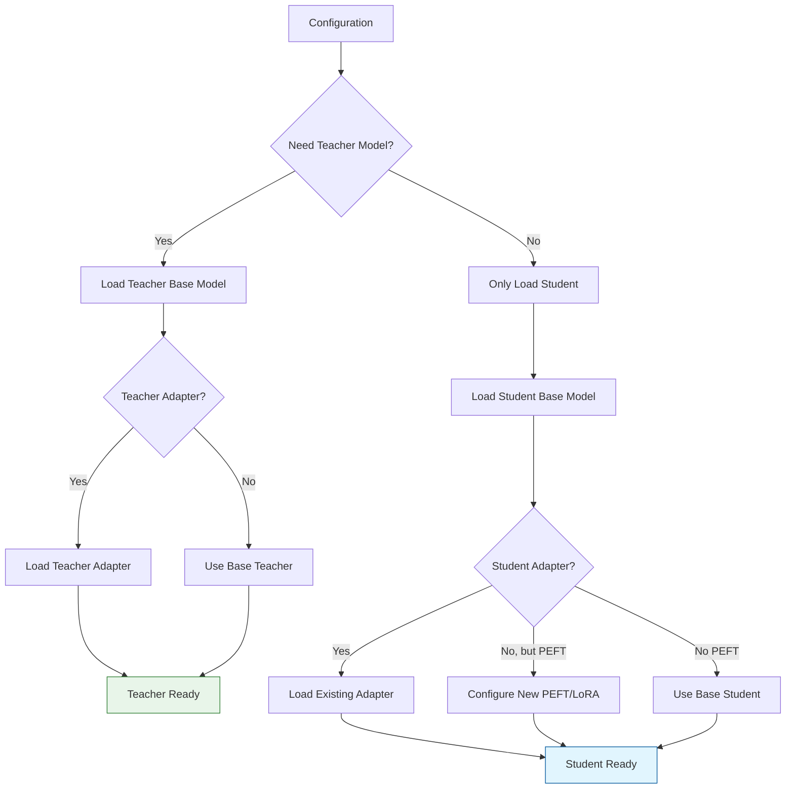

# Model Loading and Configuration

The `distillKitPlus/components/models.py` module centralizes the logic for loading and configuring language models (both student and teacher) and their corresponding tokenizers. It heavily utilizes the Hugging Face `transformers` and `peft` libraries to handle model loading, quantization, and Parameter-Efficient Fine-Tuning (PEFT).

## Model Loading Overview

The model loading system in DistilKitPlus is highly flexible, supporting various configurations:



## Core Functions in `models.py`

The module contains several helper functions that work together to load and prepare models for distillation:

<div className="overflow-x-auto mt-4">
  <table className="min-w-full divide-y divide-gray-200 dark:divide-gray-700">
    <thead>
      <tr>
        <th className="px-4 py-3 text-left text-sm font-medium text-gray-500 dark:text-gray-400 uppercase tracking-wider">Function</th>
        <th className="px-4 py-3 text-left text-sm font-medium text-gray-500 dark:text-gray-400 uppercase tracking-wider">Purpose</th>
      </tr>
    </thead>
    <tbody className="divide-y divide-gray-200 dark:divide-gray-700">
      <tr>
        <td className="px-4 py-3 text-sm font-medium text-gray-900 dark:text-gray-100">`setup_tokenizer`</td>
        <td className="px-4 py-3 text-sm text-gray-600 dark:text-gray-300">Initializes an `AutoTokenizer` with project-specific settings (padding side, pad token ID, chat templates)</td>
      </tr>
      <tr>
        <td className="px-4 py-3 text-sm font-medium text-gray-900 dark:text-gray-100">`get_model_kwargs`</td>
        <td className="px-4 py-3 text-sm text-gray-600 dark:text-gray-300">Builds keyword arguments for `AutoModelForCausalLM.from_pretrained` (data types, device_map, quantization settings)</td>
      </tr>
      <tr>
        <td className="px-4 py-3 text-sm font-medium text-gray-900 dark:text-gray-100">`load_base_model`</td>
        <td className="px-4 py-3 text-sm text-gray-600 dark:text-gray-300">Loads the foundational transformer model and prepares it for k-bit training if needed</td>
      </tr>
      <tr>
        <td className="px-4 py-3 text-sm font-medium text-gray-900 dark:text-gray-100">`configure_lora`</td>
        <td className="px-4 py-3 text-sm text-gray-600 dark:text-gray-300">Creates a `LoraConfig` and applies it to the base model using `get_peft_model`</td>
      </tr>
      <tr>
        <td className="px-4 py-3 text-sm font-medium text-gray-900 dark:text-gray-100">`load_adapter`</td>
        <td className="px-4 py-3 text-sm text-gray-600 dark:text-gray-300">Loads a pre-trained PEFT adapter onto a base model</td>
      </tr>
      <tr>
        <td className="px-4 py-3 text-sm font-medium text-gray-900 dark:text-gray-100">`setup_model`</td>
        <td className="px-4 py-3 text-sm text-gray-600 dark:text-gray-300">Orchestrates the loading of a single model (student or teacher)</td>
      </tr>
      <tr>
        <td className="px-4 py-3 text-sm font-medium text-gray-900 dark:text-gray-100">`load_models`</td>
        <td className="px-4 py-3 text-sm text-gray-600 dark:text-gray-300">Main entry point that loads all necessary models and tokenizers based on configuration</td>
      </tr>
    </tbody>
  </table>
</div>

## Key Feature: Quantization Support

DistilKitPlus leverages `bitsandbytes` for efficient 4-bit quantization of models, significantly reducing memory usage:

<div className="p-4 bg-gradient-to-r from-green-50 to-teal-50 dark:from-green-900/30 dark:to-teal-900/30 rounded-lg border border-green-100 dark:border-green-900/50 my-4">
  <h4 className="text-lg font-semibold text-green-800 dark:text-green-300">Quantization Benefits</h4>
  <div className="flex flex-col md:flex-row gap-6 mt-2">
    <div className="flex-1">
      <h5 className="font-medium text-green-800 dark:text-green-400 mb-1">Memory Usage Comparison</h5>
      <table className="min-w-full divide-y divide-green-200 dark:divide-green-800">
        <thead>
          <tr>
            <th className="px-2 py-1 text-left text-xs font-medium text-green-700 dark:text-green-300">Model</th>
            <th className="px-2 py-1 text-left text-xs font-medium text-green-700 dark:text-green-300">BF16/FP16</th>
            <th className="px-2 py-1 text-left text-xs font-medium text-green-700 dark:text-green-300">4-bit (NF4)</th>
            <th className="px-2 py-1 text-left text-xs font-medium text-green-700 dark:text-green-300">Reduction</th>
          </tr>
        </thead>
        <tbody className="divide-y divide-green-100 dark:divide-green-800/30">
          <tr>
            <td className="px-2 py-1 text-xs text-green-900 dark:text-green-100">Llama 3.1 8B</td>
            <td className="px-2 py-1 text-xs text-green-900 dark:text-green-100">~16 GB</td>
            <td className="px-2 py-1 text-xs text-green-900 dark:text-green-100">~4 GB</td>
            <td className="px-2 py-1 text-xs text-green-900 dark:text-green-100">~75%</td>
          </tr>
          <tr>
            <td className="px-2 py-1 text-xs text-green-900 dark:text-green-100">Llama 3.1 70B</td>
            <td className="px-2 py-1 text-xs text-green-900 dark:text-green-100">~140 GB</td>
            <td className="px-2 py-1 text-xs text-green-900 dark:text-green-100">~35 GB</td>
            <td className="px-2 py-1 text-xs text-green-900 dark:text-green-100">~75%</td>
          </tr>
        </tbody>
      </table>
    </div>
    <div className="flex-1">
      <h5 className="font-medium text-green-800 dark:text-green-400 mb-1">Implementation</h5>
      <div className="text-xs text-green-900 dark:text-green-100 font-mono bg-green-50/50 dark:bg-green-900/50 p-2 rounded">
        <pre>
# Within get_model_kwargs
if config.get("quantization", {}).get("enabled", False):
    quantization_config = BitsAndBytesConfig(
        load_in_4bit=True,
        bnb_4bit_quant_type="nf4",
        bnb_4bit_compute_dtype=torch_dtype,
        bnb_4bit_use_double_quant=True
    )
    kwargs["quantization_config"] = quantization_config
        </pre>
      </div>
      <p className="mt-2 text-sm text-green-800 dark:text-green-200">Enable via config: <code>{"quantization": {"enabled": true}}</code></p>
    </div>
  </div>
</div>

## Key Feature: PEFT/LoRA Support

Parameter-Efficient Fine-Tuning (PEFT) methods like LoRA allow efficient distillation by training just a small set of additional parameters instead of all model weights:

<div className="p-4 bg-gradient-to-r from-blue-50 to-indigo-50 dark:from-blue-900/30 dark:to-indigo-900/30 rounded-lg border border-blue-100 dark:border-blue-900/50 my-4">
  <h4 className="text-lg font-semibold text-blue-800 dark:text-blue-300">LoRA Configuration</h4>
  <p className="mb-2 text-gray-700 dark:text-gray-300">LoRA adds small trainable rank decomposition matrices to specific layers:</p>
  
  <div className="flex flex-col md:flex-row gap-4 mt-2">
    <div className="flex-1">
      <h5 className="font-medium text-blue-800 dark:text-blue-400 mb-1">Key Parameters</h5>
      <ul className="list-disc list-inside text-sm text-gray-700 dark:text-gray-300 space-y-1">
        <li><strong>r</strong>: Rank of the decomposition (typically 8-64)</li>
        <li><strong>alpha</strong>: Scaling factor for stability</li>
        <li><strong>target_modules</strong>: Which layers to apply LoRA to</li>
        <li><strong>bias</strong>: Whether to train bias terms</li>
      </ul>
      <p className="mt-2 text-sm text-gray-700 dark:text-gray-300">Typical trainable parameters: <code>< 1%</code> of full model</p>
    </div>
    <div className="flex-1">
      <h5 className="font-medium text-blue-800 dark:text-blue-400 mb-1">Configuration Example</h5>
      <div className="text-xs text-gray-800 dark:text-gray-200 font-mono bg-gray-50 dark:bg-gray-800/50 p-2 rounded">
        <pre>
"lora": {
  "enable_training": true,
  "r": 16,
  "alpha": 32,
  "dropout": 0.05,
  "bias": "none",
  "task_type": "CAUSAL_LM",
  "target_modules": [
    "q_proj", "k_proj", "v_proj", "o_proj",
    "gate_proj", "up_proj", "down_proj"
  ]
}
        </pre>
      </div>
    </div>
  </div>
</div>

## Main Entry Point: `load_models`

This is the primary function used externally to load all necessary models and tokenizers based on the provided configuration dictionary.

### Function Signature

```python
def load_models(config: Dict[str, Any]) -> Dict[str, Any]:
    """
    Load student and teacher models based on configuration.
    
    Returns:
        Dict containing 'student_model', 'student_tokenizer',
        and optionally 'teacher_model', 'teacher_tokenizer'
    """
```

### Scenarios Supported

The function handles different distillation scenarios automatically based on your configuration:

<div className="overflow-x-auto mt-4 mb-6">
  <table className="min-w-full divide-y divide-gray-200 dark:divide-gray-700">
    <thead>
      <tr>
        <th className="px-4 py-3 text-left text-sm font-medium text-gray-500 dark:text-gray-400 uppercase tracking-wider">Scenario</th>
        <th className="px-4 py-3 text-left text-sm font-medium text-gray-500 dark:text-gray-400 uppercase tracking-wider">Configuration</th>
        <th className="px-4 py-3 text-left text-sm font-medium text-gray-500 dark:text-gray-400 uppercase tracking-wider">What Gets Loaded</th>
      </tr>
    </thead>
    <tbody className="divide-y divide-gray-200 dark:divide-gray-700">
      <tr>
        <td className="px-4 py-3 text-sm text-gray-600 dark:text-gray-300">Full Model Distillation<br/>(On-the-fly)</td>
        <td className="px-4 py-3 text-sm text-gray-600 dark:text-gray-300">
          <code>teacher: "path/to/model"</code><br/>
          <code>logits_file: null</code><br/>
          <code>lora.enable_training: false</code>
        </td>
        <td className="px-4 py-3 text-sm text-gray-600 dark:text-gray-300">
          - Full teacher model<br/>
          - Full student model<br/>
          - Both tokenizers
        </td>
      </tr>
      <tr>
        <td className="px-4 py-3 text-sm text-gray-600 dark:text-gray-300">LoRA Distillation<br/>(On-the-fly)</td>
        <td className="px-4 py-3 text-sm text-gray-600 dark:text-gray-300">
          <code>teacher: "path/to/model"</code><br/>
          <code>logits_file: null</code><br/>
          <code>lora.enable_training: true</code>
        </td>
        <td className="px-4 py-3 text-sm text-gray-600 dark:text-gray-300">
          - Full teacher model<br/>
          - Student model with LoRA<br/>
          - Both tokenizers
        </td>
      </tr>
      <tr>
        <td className="px-4 py-3 text-sm text-gray-600 dark:text-gray-300">Pre-computed<br/>Logits Distillation</td>
        <td className="px-4 py-3 text-sm text-gray-600 dark:text-gray-300">
          <code>teacher: null</code><br/>
          <code>logits_file: "path/to/file"</code><br/>
          <code>teacher_vocab_size: 123456</code>
        </td>
        <td className="px-4 py-3 text-sm text-gray-600 dark:text-gray-300">
          - Only student model<br/>
          - Student tokenizer<br/>
          - No teacher model loaded
        </td>
      </tr>
      <tr>
        <td className="px-4 py-3 text-sm text-gray-600 dark:text-gray-300">Adapter-based<br/>Distillation</td>
        <td className="px-4 py-3 text-sm text-gray-600 dark:text-gray-300">
          <code>teacher: "path/to/model"</code><br/>
          <code>teacher_adapter: "path/to/adapter"</code><br/>
          <code>student_adapter: "path/to/adapter"</code>
        </td>
        <td className="px-4 py-3 text-sm text-gray-600 dark:text-gray-300">
          - Teacher model with adapter<br/>
          - Student model with adapter<br/>
          - Both tokenizers
        </td>
      </tr>
    </tbody>
  </table>
</div>

## Flash Attention Support

DistilKitPlus also supports Flash Attention 2 for faster training on compatible GPUs:

```python
# Example configuration
{
  "model_config": {
    "use_flash_attention": true
  }
}
```

This is implemented in `get_model_kwargs` where it adds:

```python
if config.get("model_config", {}).get("use_flash_attention", False):
    kwargs["attn_implementation"] = "flash_attention_2"
```

Flash Attention 2 provides significant speedups for transformer attention calculations on modern GPUs (A100, H100, etc.).

## Using Model Loading in Your Code

Here's an example of using the model loading system:

```python
from distillKitPlus.components.models import load_models
import json

# 1. Load your configuration
with open("config/my_distillation_config.json", "r") as f:
    config = json.load(f)

# 2. Load models and tokenizers
models_dict = load_models(config)

# 3. Access the loaded components
student_model = models_dict["student_model"]
student_tokenizer = models_dict["student_tokenizer"]

# If using on-the-fly logits
if "teacher_model" in models_dict:
    teacher_model = models_dict["teacher_model"]
    teacher_tokenizer = models_dict["teacher_tokenizer"]
```

## Best Practices

1. **Quantization for Large Models:**
   - Always enable quantization when working with models larger than ~7B parameters
   - Use BF16 precision for mixed precision training on compatible hardware

2. **LoRA for Efficient Distillation:**
   - Start with medium rank values (r=16 or r=32)
   - Include all attention layers (`q_proj`, `k_proj`, `v_proj`, `o_proj`)
   - Include MLP layers for transformer blocks (`gate_proj`, `up_proj`, `down_proj`)

3. **Flash Attention for Speed:**
   - Enable when using A100/H100 GPUs to significantly accelerate training
   - Make sure your PyTorch and transformers versions support it

4. **Handling Large Teachers:**
   - For teachers larger than your GPU memory, use pre-computed logits
   - When pre-computing logits, record the teacher's vocabulary size