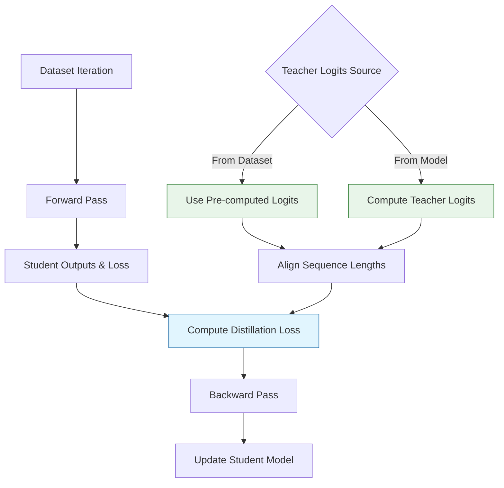

# LogitsTrainer

The `distillKitPlus` library provides a specialized trainer, `LogitsTrainer`, located in `distillKitPlus/components/trainer.py`. This trainer extends the `trl.SFTTrainer` (Supervised Fine-tuning Trainer from the TRL library) to facilitate knowledge distillation, particularly when using teacher model logits.

## How LogitsTrainer Works

The `LogitsTrainer` orchestrates the entire distillation process through these key stages:



## Initialization Parameters

Besides the standard arguments accepted by `trl.SFTTrainer`, `LogitsTrainer` accepts the following distillation-specific parameters:

<div className="overflow-x-auto">
  <table className="min-w-full divide-y divide-gray-200 dark:divide-gray-700">
    <thead>
      <tr>
        <th className="px-4 py-3 text-left text-sm font-medium text-gray-500 dark:text-gray-400 uppercase tracking-wider">Parameter</th>
        <th className="px-4 py-3 text-left text-sm font-medium text-gray-500 dark:text-gray-400 uppercase tracking-wider">Type</th>
        <th className="px-4 py-3 text-left text-sm font-medium text-gray-500 dark:text-gray-400 uppercase tracking-wider">Default</th>
        <th className="px-4 py-3 text-left text-sm font-medium text-gray-500 dark:text-gray-400 uppercase tracking-wider">Description</th>
      </tr>
    </thead>
    <tbody className="divide-y divide-gray-200 dark:divide-gray-700">
      <tr>
        <td className="px-4 py-3 text-sm font-medium text-gray-900 dark:text-gray-100">temperature</td>
        <td className="px-4 py-3 text-sm text-gray-600 dark:text-gray-300">float</td>
        <td className="px-4 py-3 text-sm text-gray-600 dark:text-gray-300">2.0</td>
        <td className="px-4 py-3 text-sm text-gray-600 dark:text-gray-300">Temperature for softening distributions (higher = softer)</td>
      </tr>
      <tr>
        <td className="px-4 py-3 text-sm font-medium text-gray-900 dark:text-gray-100">alpha</td>
        <td className="px-4 py-3 text-sm text-gray-600 dark:text-gray-300">float</td>
        <td className="px-4 py-3 text-sm text-gray-600 dark:text-gray-300">0.1</td>
        <td className="px-4 py-3 text-sm text-gray-600 dark:text-gray-300">Weight for distillation loss (0-1)</td>
      </tr>
      <tr>
        <td className="px-4 py-3 text-sm font-medium text-gray-900 dark:text-gray-100">loss_type</td>
        <td className="px-4 py-3 text-sm text-gray-600 dark:text-gray-300">str</td>
        <td className="px-4 py-3 text-sm text-gray-600 dark:text-gray-300">"fkl"</td>
        <td className="px-4 py-3 text-sm text-gray-600 dark:text-gray-300">Type of distillation loss (fkl, uld, multi-ot, etc.)</td>
      </tr>
      <tr>
        <td className="px-4 py-3 text-sm font-medium text-gray-900 dark:text-gray-100">k</td>
        <td className="px-4 py-3 text-sm text-gray-600 dark:text-gray-300">int</td>
        <td className="px-4 py-3 text-sm text-gray-600 dark:text-gray-300">100</td>
        <td className="px-4 py-3 text-sm text-gray-600 dark:text-gray-300">Top-k parameter for uld/multi-ot losses</td>
      </tr>
      <tr>
        <td className="px-4 py-3 text-sm font-medium text-gray-900 dark:text-gray-100">student_temperature</td>
        <td className="px-4 py-3 text-sm text-gray-600 dark:text-gray-300">float</td>
        <td className="px-4 py-3 text-sm text-gray-600 dark:text-gray-300">temperature</td>
        <td className="px-4 py-3 text-sm text-gray-600 dark:text-gray-300">Specific temperature for student logits</td>
      </tr>
      <tr>
        <td className="px-4 py-3 text-sm font-medium text-gray-900 dark:text-gray-100">teacher_temperature</td>
        <td className="px-4 py-3 text-sm text-gray-600 dark:text-gray-300">float</td>
        <td className="px-4 py-3 text-sm text-gray-600 dark:text-gray-300">temperature</td>
        <td className="px-4 py-3 text-sm text-gray-600 dark:text-gray-300">Specific temperature for teacher logits</td>
      </tr>
      <tr>
        <td className="px-4 py-3 text-sm font-medium text-gray-900 dark:text-gray-100">skip_eos</td>
        <td className="px-4 py-3 text-sm text-gray-600 dark:text-gray-300">bool</td>
        <td className="px-4 py-3 text-sm text-gray-600 dark:text-gray-300">False</td>
        <td className="px-4 py-3 text-sm text-gray-600 dark:text-gray-300">Whether to exclude EOS token from loss</td>
      </tr>
      <tr>
        <td className="px-4 py-3 text-sm font-medium text-gray-900 dark:text-gray-100">loss_kwargs</td>
        <td className="px-4 py-3 text-sm text-gray-600 dark:text-gray-300">Optional[Dict]</td>
        <td className="px-4 py-3 text-sm text-gray-600 dark:text-gray-300">None</td>
        <td className="px-4 py-3 text-sm text-gray-600 dark:text-gray-300">Additional loss-specific parameters</td>
      </tr>
      <tr>
        <td className="px-4 py-3 text-sm font-medium text-gray-900 dark:text-gray-100">teacher_model</td>
        <td className="px-4 py-3 text-sm text-gray-600 dark:text-gray-300">Optional[PreTrainedModel]</td>
        <td className="px-4 py-3 text-sm text-gray-600 dark:text-gray-300">None</td>
        <td className="px-4 py-3 text-sm text-gray-600 dark:text-gray-300">Teacher model for on-the-fly logit generation</td>
      </tr>
    </tbody>
  </table>
</div>

Many of these parameters can be specified in your configuration file under the `distillation` section:

```json
{
  "distillation": {
    "temperature": 2.0,
    "alpha": 0.1,
    "loss_type": "fkl",
    "k": 100,
    "skip_eos": false,
    "loss_kwargs": {
      "log_loss_weight": 0.1,
      "sikhorn_loss_weight": 0.1
    }
  }
}
```

## Core Implementation

The `LogitsTrainer` introduces several key methods to handle the distillation process:

### `compute_loss`

This is the main method that overrides the standard training loss calculation:

1. **Get Student Outputs**: Runs the forward pass of the student model to get logits and standard task loss
2. **Get Teacher Logits**: Either loads pre-computed logits from the batch inputs or generates them on-the-fly
3. **Align Sequence Lengths**: Ensures teacher and student logits have matching dimensions
4. **Calculate Combined Loss**: Calls `compute_distillation_loss` to combine task and distillation losses

<div className="p-4 bg-gradient-to-r from-blue-50 to-indigo-50 dark:from-blue-900/30 dark:to-indigo-900/30 rounded-lg border border-blue-100 dark:border-blue-900/50 my-4">
  <h4 className="text-lg font-semibold text-blue-800 dark:text-blue-300">Implementation Highlight</h4>
  <div className="text-sm text-gray-700 dark:text-gray-300 font-mono bg-gray-50 dark:bg-gray-800/50 p-3 rounded overflow-x-auto">
    <pre>
def compute_loss(self, model, inputs, return_outputs=False):
    # Run student model forward pass
    student_outputs = model(**inputs)
    
    # Get teacher logits (from dataset or on-the-fly)
    if "logits" in inputs:
        teacher_logits = inputs["logits"]
    else:
        teacher_logits = self._compute_teacher_logits(inputs)
    
    # Align sequence dimensions between student and teacher
    student_logits, teacher_logits = self._align_sequence_length(
        student_outputs.logits, teacher_logits
    )
    
    # Compute combined loss
    loss = compute_distillation_loss(
        student_logits=student_logits,
        teacher_logits=teacher_logits,
        original_loss=student_outputs.loss,
        inputs=inputs,
        alpha=self.alpha,
        temperature=self.temperature,
        loss_type=self.loss_type,
        k=self.k,
        **self.loss_kwargs
    )
    
    return (loss, student_outputs) if return_outputs else loss
    </pre>
  </div>
</div>

### `_compute_teacher_logits`

This method is used when pre-computed logits are not provided in the dataset:

1. Requires the `teacher_model` to be provided during initialization
2. Creates a copy of the input batch without labels to avoid teacher seeing the ground truth
3. Runs the teacher model's forward pass with gradient calculation disabled
4. Returns the teacher's raw logits for distillation

### `_align_sequence_length`

This helper method ensures that teacher and student logits have compatible shapes:

1. Gets sequence lengths for both student and teacher outputs
2. If lengths differ, either:
   - Truncates the longer sequence to match the shorter one
   - Pads the shorter sequence with zeros to match the longer one (rare)
3. Returns aligned logit tensors that can be directly compared

## Distillation Modes

The `LogitsTrainer` supports two primary distillation scenarios:

<div className="flex flex-col md:flex-row gap-4 my-6">
  <div className="flex-1 p-4 border border-green-200 rounded-lg bg-green-50 dark:bg-green-900/30 dark:border-green-900/50">
    <h3 className="text-lg font-medium text-green-800 dark:text-green-400 mb-2">Pre-computed Logits Mode</h3>
    <p className="text-gray-700 dark:text-gray-300 mb-2">Teacher logits are pre-calculated and loaded with the dataset:</p>
    <ul className="list-disc list-inside text-gray-700 dark:text-gray-300 space-y-1">
      <li>Lower memory usage (only loads student model)</li>
      <li>Enables distillation from very large teachers</li>
      <li>Requires dataset with `logits` field</li>
      <li>Static - logits are fixed after pre-computation</li>
    </ul>
  </div>
  
  <div className="flex-1 p-4 border border-blue-200 rounded-lg bg-blue-50 dark:bg-blue-900/30 dark:border-blue-900/50">
    <h3 className="text-lg font-medium text-blue-800 dark:text-blue-400 mb-2">On-the-fly Logits Mode</h3>
    <p className="text-gray-700 dark:text-gray-300 mb-2">Teacher model generates logits during training:</p>
    <ul className="list-disc list-inside text-gray-700 dark:text-gray-300 space-y-1">
      <li>Higher memory usage (loads both models)</li>
      <li>No pre-computation step needed</li>
      <li>Requires `teacher_model` parameter</li>
      <li>Dynamic - teacher can adapt with augmentations</li>
    </ul>
  </div>
</div>

## Training Workflow

Here's how to use the LogitsTrainer in your distillation pipeline:

```python
from distillKitPlus.components.models import load_models
from distillKitPlus.components.dataset import DistillationDataset
from distillKitPlus.components.trainer import LogitsTrainer
from transformers import TrainingArguments

# 1. Load configuration
config = json.load(open("config/my_config.json"))

# 2. Load models and tokenizers
models_dict = load_models(config)
student_model = models_dict["student_model"]
student_tokenizer = models_dict["student_tokenizer"]
teacher_model = models_dict.get("teacher_model")  # Optional

# 3. Create dataset
dataset = DistillationDataset(
    file_path=config["dataset"]["name"],
    tokenizer=student_tokenizer,
    max_seq_length=config["tokenizer"]["max_length"],
    teacher_vocab_size=config["models"]["teacher_vocab_size"],
    logits_file=config["dataset"].get("logits_file"),
    # other dataset parameters
)

# 4. Set up training arguments
training_args = TrainingArguments(**config["training"])

# 5. Initialize LogitsTrainer
trainer = LogitsTrainer(
    model=student_model,
    args=training_args,
    train_dataset=dataset,
    teacher_model=teacher_model,  # Only if using on-the-fly logits
    temperature=config["distillation"]["temperature"],
    alpha=config["distillation"]["alpha"],
    loss_type=config["distillation"]["loss_type"],
    k=config["distillation"].get("k", 100),
    # other distillation parameters
)

# 6. Train the model
trainer.train()

# 7. Save the final model
trainer.save_model(os.path.join(training_args.output_dir, "final-distilled-checkpoint"))
```

## Best Practices

1. **Memory Optimization:**
   - For large teacher models, prefer pre-computed logits
   - If using on-the-fly mode with large models, enable quantization

2. **Loss Selection:**
   - For same-architecture distillation, start with `loss_type="fkl"`
   - For cross-architecture distillation, try `loss_type="uld"` or `loss_type="multi-ot"`

3. **Parameter Tuning:**
   - `temperature`: Higher values (2.0-4.0) create softer distributions that transfer more knowledge
   - `alpha`: Typical values are 0.1-0.3, balance based on your specific models
   - For `multi-ot` loss, adjust `log_loss_weight` and `sikhorn_loss_weight` in `loss_kwargs`

4. **Training Speed:**
   - When using pre-computed logits, you can safely disable `use_cache=False` in model configuration
   - Enable Flash Attention 2 via `model_config.use_flash_attention: true` if your model supports it