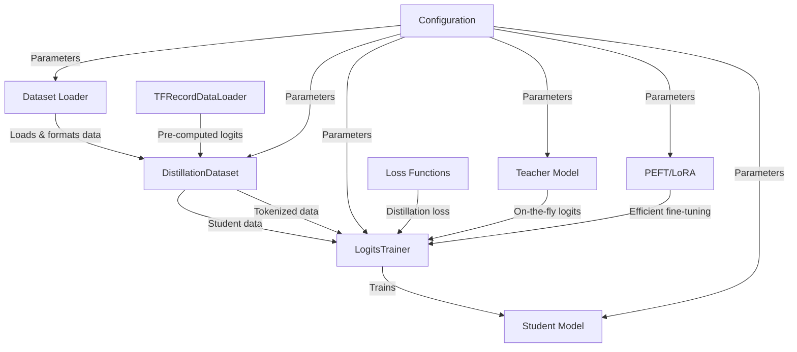

# Welcome to DistilKitPlus

`DistilKitPlus` is an open-source toolkit designed for high-performance knowledge distillation, specifically tailored for Large Language Models (LLMs). It enables you to create smaller, faster, and more efficient models that retain the capabilities of larger teacher models.

Inspired by `acree-ai/DistillKit`, this project provides an easy-to-use framework with a particular focus on supporting **offline distillation** (using pre-computed teacher logits) and **Parameter-Efficient Fine-Tuning (PEFT)** methods like LoRA, making it suitable for environments with limited computational resources.

  

    

      <h3 className="text-lg font-medium text-green-800 dark:text-green-400 mb-2">Why DistilKitPlus?</h3>
      <ul className="list-disc list-inside text-gray-700 dark:text-gray-300 space-y-1">
        <li>Reduce model size by up to 10x while preserving capabilities</li>
        <li>Lower deployment costs with smaller, quantized models</li>
        <li>Improve inference speed for production applications</li>
        <li>Maintain high-quality outputs with proven distillation techniques</li>
        <li>Fine-tune efficiently with minimal computational resources</li>
      </ul>
    

    

      
      
    

  

## Key Features

*   ✅ **Logit Distillation**: Supports standard knowledge distillation using logits, primarily for same-architecture teacher/student pairs.
*   💾 **Pre-Computed Logits**: Train efficiently by generating teacher logits beforehand, saving memory during the student training phase (See [Generating Teacher Logits](./quickstart#generating-teacher-logits-optional)).
*   🚀 **PEFT Integration**: Leverages the `peft` library for efficient fine-tuning techniques like LoRA.
*   ⚙️ **Quantization Support**: Load base models in 4-bit precision using `bitsandbytes` for reduced memory footprint and potentially faster execution.
*   🌐 **Distributed Training**: Integrates with Hugging Face `accelerate` and `deepspeed` for scaling training across multiple GPUs or nodes.
*   🧩 **Flexible Loss Functions**: Includes various distillation loss options like Forward KL Divergence (`fkl`), Unbiased Logit Distillation (`uld`), and Multi-Level Optimal Transport (`multi-ot`).

## System Architecture

DistilKitPlus follows a modular architecture where components work together to enable efficient knowledge distillation:

## Getting Started

Ready to distill your own model? Head over to the [Quickstart](./quickstart) guide to set up the library and run your first distillation job.

## Dive Deeper

Explore the **Essentials** section in the sidebar to understand the core components:

*   **[Configuration](./essentials/configuration)**: Learn how to set up your distillation runs.
*   **[Datasets](./essentials/datasets)**: Understand how data and logits are handled.
*   **[Models](./essentials/models)**: See how student and teacher models are loaded and configured (including PEFT and quantization).
*   **[Trainer](./essentials/trainer)**: Discover the custom `LogitsTrainer` used for distillation.
*   **[Losses](./essentials/losses)**: Explore the available distillation loss functions.
*   **[Formatters](./essentials/formatters)**: Learn how raw data is prepared for the models.

---

*Reference [1]:* [https://github.com/agokrani/distillKitPlus](https://github.com/agokrani/distillKitPlus)