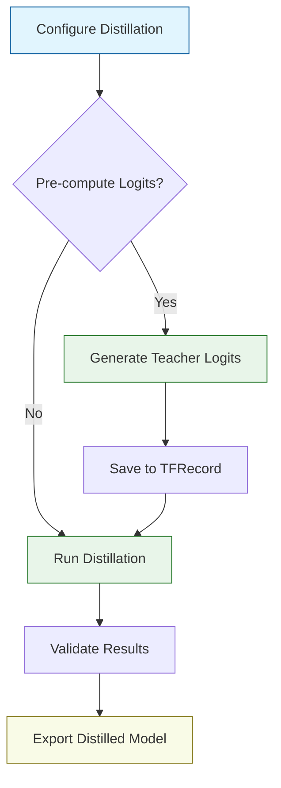

# Quickstart Guide

This guide will help you set up DistilKitPlus and run your first knowledge distillation process on language models. Follow these steps to quickly get a student model that mimics the capabilities of a larger teacher model.

## Installation

First, clone the repository and install the necessary dependencies.

```bash
git clone https://github.com/agokrani/distillKitPlus.git
cd distillKitPlus
pip install -r requirements.txt
pip install -e .  # Install the package in editable mode
```

Make sure you have the following key dependencies installed:
- `torch`: PyTorch library for deep learning
- `transformers`: Hugging Face's transformers library
- `peft`: Parameter-Efficient Fine-Tuning methods
- `datasets`: For handling datasets efficiently
- `accelerate`: For distributed training (optional)
- `bitsandbytes`: For quantization support (optional)
- `deepspeed`: For advanced distributed training (optional)

## Distillation Workflow

The distillation process in DistilKitPlus follows this general workflow:



## Running a Distillation Job

### Step 1: Configure Your Distillation

Start by creating a configuration file:

1. Navigate to the `config/` directory
2. Copy a template config (e.g., `default_config.json` or `config_online_qwq_phi4_uld.json`)
3. Edit the configuration parameters according to your needs

Here's an example of the key sections you'll need to modify:

```json
{
  "project_name": "my-first-distillation",
  "dataset": {
    "name": "tatsu-lab/alpaca",  // Your dataset path
    "logits_file": null,         // Set to path of .tfrecord if using pre-computed logits
    "num_samples": 10000         // Limit samples for faster testing
  },
  "models": {
    "teacher": "meta-llama/Llama-3.1-70B-Instruct",  // Your teacher model
    "student": "meta-llama/Llama-3.1-8B-Instruct",   // Your student model
    "teacher_vocab_size": 128256                     // Required for pre-computed logits
  },
  "tokenizer": {
    "max_length": 2048  // Adjust based on your GPU memory
  },
  "training": {
    "output_dir": "./distilled_model",
    "per_device_train_batch_size": 1,
    "num_train_epochs": 3,
    "learning_rate": 2e-5
  },
  "distillation": {
    "temperature": 2.0,
    "alpha": 0.1,
    "loss_type": "fkl"  // Try "uld" or "multi-ot" for better results
  },
  "lora": {
    "enable_training": true,
    "r": 16,
    "alpha": 32
  },
  "quantization": {
    "enabled": true  // Set to false if you have sufficient GPU memory
  }
}
```

Refer to the [Configuration](./essentials/configuration) page for detailed explanations of all available parameters.

### Step 2: Run the Distillation Script

Execute the `distill_logits.py` script with your configuration:

```bash
# Running with local resources
python scripts/local/distill_logits.py --config config/my_config.json

# Running with Accelerate for multi-GPU training
accelerate launch scripts/local/distill_logits.py --config config/my_config.json
```

### Step 3: Monitor Training Progress

The script will output training logs to the console, showing:
- Loss values (combined, distillation, and task losses)
- Learning rate changes
- Training speed (samples/second)
- GPU memory usage

If you've configured Weights & Biases integration, you can also monitor these metrics in real-time via the WandB dashboard.

<div className="flex justify-center mb-8">
  
</div>

### Step 4: Use Your Distilled Model

Once training completes, the final model will be saved to the directory specified in `training.output_dir` with a subdirectory called `final-distilled-checkpoint`. You can load it like any Hugging Face model:

```python
from transformers import AutoModelForCausalLM, AutoTokenizer

# For full model distillation
model_path = "path/to/training.output_dir/final-distilled-checkpoint"
model = AutoModelForCausalLM.from_pretrained(model_path)
tokenizer = AutoTokenizer.from_pretrained(model_path)

# For LoRA adapter
from peft import PeftModel, PeftConfig

base_model_id = "meta-llama/Llama-3.1-8B-Instruct"  # Your student model
adapter_path = "path/to/training.output_dir/final-distilled-checkpoint"

model = AutoModelForCausalLM.from_pretrained(base_model_id)
model = PeftModel.from_pretrained(model, adapter_path)
tokenizer = AutoTokenizer.from_pretrained(base_model_id)
```

## Generating Teacher Logits (Optional)

For more memory-efficient training, especially with very large teacher models, you can pre-compute teacher logits:

```bash
python scripts/local/generate_logits.py \
  --config config/logit_generation_config.json \
  --output_file path/to/save/teacher_logits.tfrecord
```

Then update your distillation config to use these pre-computed logits:

```json
{
  "dataset": {
    "logits_file": "path/to/save/teacher_logits.tfrecord"
  },
  "models": {
    "teacher": null,  // No need to load teacher model
    "teacher_vocab_size": 128256  // Must match the teacher model that generated logits
  }
}
```

## Next Steps

- Explore the [Datasets](./essentials/datasets) section to understand how to prepare your data
- Learn about different [Loss Functions](./essentials/losses) to optimize your distillation
- Check [Configuration](./essentials/configuration) for all available settings
- See [Models](./essentials/models) for details on loading and configuring models

## Troubleshooting

**Out of Memory Errors?**
- Enable quantization (`quantization.enabled: true`)
- Use LoRA instead of full fine-tuning (`lora.enable_training: true`)
- Reduce `per_device_train_batch_size` and increase `gradient_accumulation_steps`
- Pre-compute teacher logits to avoid loading both teacher and student models
- Reduce `tokenizer.max_length` to process shorter sequences

**Training Too Slow?**
- Use Accelerate or DeepSpeed for multi-GPU training
- Enable Flash Attention 2 (`model_config.use_flash_attention: true`)
- Consider using BF16 mixed precision (`training.bf16: true`) on supported hardware